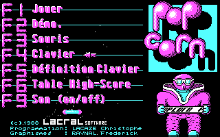
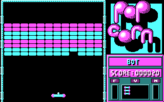

# Popcorn — the game's own code, reconstructed

<p align="center">


</p>

C reconstructed from the disassembly of **Popcorn** (Christophe Lacaze /
Frédérick Raynal, LACRAL software, 1988), a routine at a time, each carrying
the address in the original it was read from. It builds and plays:

```sh
make && ./popcorn
```

Both screenshots above are the port's own output, captured from it with
`popcorn-dev --shot`: the menu it draws at startup, and the first level in
play. The name in the panel is the bot's - `popcorn-dev --autoplay` plays the
game by itself, which is how the port gets watched without a person at the
paddle.

**On the colours.** The game asks BIOS for mode 05h, and on a real CGA driving
an RGBI monitor that clears the colour burst and forces cyan, red and white
whatever the palette register says. That is not the picture above, and it is
not the one the authors had. A card that only *emulates* mode 05h does not
carry the quirk over, and by 1988 the game was as likely to be running on an
EGA or VGA board through the newer connector - where the palette bit governs,
BIOS has left palette 1 at high intensity in the colour-select register, and
the game comes up in light cyan, light magenta and white. That is what its
authors saw while they wrote it, what a player of the time saw, and what the
port draws. DOSBox shows the same.

The CGA's own output is still reachable for comparison: the emulator this port
is checked against renders it with `--rgbi`.

**The game is here**, because its authors put it in the public domain. From
`popcorn.doc`, in their own words:

> Ce programme fait parti du domaine public. Il ne doit servir à aucune fin
> commerciale sans accord préalable de […]

That is from [`popcorn.doc`](popcorn.doc), the authors' own readme, which ships
here as they wrote it - decoded from CP850 to UTF-8 so it can be read without a
DOS codepage, and otherwise untouched. It is worth reading: the menu keys, how
POPGEN's level sets work, and an address in Brive-la-Gaillarde to send
"remarques, suggestions, félicitations ou insultes" to.

Public domain, then, with the one condition they attached: **not for
commercial use without their prior agreement.** That condition travels with
the files, and it is theirs rather than this repository's to waive.

So `popcorn.exe` is here, and the port needs it — every sprite, font, level
table and string the game has lives in the first 0x1ac20 bytes of that
executable, which the port unpacks at startup and reads its data from. Nothing
of the game is embedded in the C; it is read at run time from the file beside
it. The two shipped level sets are here too, and `POPGEN.EXE`, which made
them, and `POPSPEED.EXE`, which sets the game speed:

```sh
make && ./popcorn          # the fifty levels built into the executable
./popcorn POPTAB           # POPTAB.PPC instead, as POPGEN wrote it
./popcorn LTF              # LTF.PPC
```

`POPCORN_EXE` points at a copy kept somewhere else. Everything the game reads
and writes — the executable, the `.ppc` sets, and `popcorn.hsc` — is relative
to the current directory, as it was under DOS. `popcorn.hsc` is not in here:
the game writes it, so it is a save file rather than part of the game, and one
player's scores are nobody else's starting point.

Needs SDL3 and a C99 compiler. `make` prints what to install if it cannot find
SDL3.

## What this is

The original is **hand-written 16-bit x86 assembly** — not compiled. There are
zero `push bp; mov bp,sp` sequences in its 23,696 bytes of code, no C runtime,
one code segment and one flat data area, with arguments passed in registers and
threaded across calls. So there are no compiler idioms to reverse and every
instruction is a decision someone made, which is why this is written as
structured C that reads as a game rather than as transliterated
register-shuffling. Where a routine cannot honestly be written that way, it is
written literally and says why.

Every integer is a `stdint` one. `int16_t` says "this truncation is the
`imul`'s"; `short` only says "some signed type".

## Where it deviates from the original

Three places, deliberately, and this is the whole list.

**The play loop runs on a clock, not on the original's busy-waits.** The
original paces itself with `mov cx,N / loop $`, about 24,500 cycles to a frame,
which is **326 Hz** at the 8 MHz its readme names. Reproducing those as sleeps
made the game's speed a property of the host's scheduler rather than of the
game, so the loop runs on a fixed 326 Hz tick against an absolute clock
instead, and the screen is presented on the CGA refresh.

The rate is measured rather than guessed - every instruction of a frame hooked
under the emulator and costed from the iAPX 86/88 manual's table, which lands
within two Hz whether the paddle is moving or still and on a different level,
because three-quarters of the frame is `loop $` at exactly 17 cycles a turn.
It is an upper bound: the manual's timings exclude instruction fetch, and a
real 8086 empties its prefetch queue on every branch.

Getting there needed one non-obvious thing. `FRAME_DELAY` is 0x1f4 empty loops
reloaded every frame, and `draw_paddle_shifted` takes 0x1f3 of them *back* if
the paddle actually moved: the 500 **is** the author's estimate of what
redrawing the paddle costs, and the delay is there to make the moved and still
branches take the same time. A port that redraws the paddle in native code for
free only ever runs the cheap branch, and comes out about twice too fast. One
consequence of pacing on a clock is that every frame now costs the same, where
the original's was only approximately so - it sped up a little when the paddle
sat still.

**`POPSPEED`'s setting no longer reaches the game.** Its whole job was to trim
the busy-wait the play loop paced itself on, and the play loop does not pace on
it any more. `popspeed.exe` still ships, and `game_delay` still runs at the
readme's default of 110 everywhere outside the play loop - the intro, the level
transitions, the ending.

**Two screens are not transcribed.** F10 is the boss key, which paints a fake
DOS prompt over the game; under a window of its own it protects nobody, so it
does nothing. F5 redefines left, right and launch on a text screen; the port
keeps the defaults, **J**, **K** and space. Both are understood, and are no-ops
with a comment rather than gaps.

## How it is known to be right

It is not asserted, it is measured. The port runs beside an emulator running
the original, in lockstep, and the two are compared **byte for byte** — the
whole 133,296-byte image and the 16K of video memory, every frame. Separately,
each routine is captured at its entry, the original is run to its return, the C
is run on the same capture, and the results are diffed.

That machinery lives in the repository this was split from, along with the
disassembly notes: <https://github.com/borancar/Popcorn/tree/develop>.

A second binary, `popcorn-dev`, carries the flags that exist to *check* the
port — the lockstep protocol, single-routine verification, screenshots, a bot
that plays the game by itself. `popcorn` takes what the original takes and
nothing else, because that command line is part of what the port is.

## Files

**`src/` is the game. `tools/` is what exists to check it.**

| | |
| --- | --- |
| `src/main.c` | `popcorn` — the game, and its one optional argument |
| `src/game.c` | the transcription: every routine, each with its `1ac2:xxxx` |
| `src/game.h` | types, the named image offsets, the backend interface |
| `src/exepack.c` | the EXEPACK decoder that recovers the data at startup |
| `src/sdl_io.c` | window, presentation, keyboard, mouse, retrace, delay |
| `src/stubs.c` | what is not transcribed. One safety net is left in it |
| `tools/devmain.c` | `popcorn-dev` — the same game with the harness flags |
| `tools/autoplay.c` | the bot, for `popcorn-dev --autoplay` |
| `tools/lockstep.c`, `tools/verify.c` | the two halves of the checking, on this side |

Both binaries link both halves, because the game's own code calls into them:
`sdl_io.c` asks the bot whether it is driving, and `game.c` offers the extra
sync points the driver compares screens at. They cost nothing when nothing has
turned them on, and the alternative is `#ifdef`s through a transcription,
which would make it harder to read against the disassembly than it needs to
be.

## Licence

Two works, and they are not the same one.

**The game** — `popcorn.exe`, the `.ppc` sets, `popgen.exe`, `popspeed.exe`,
`popcorn.doc` — is Christophe Lacaze's and Frédérick Raynal's, placed by them
in the public domain in `popcorn.doc`, with the condition that it not be put
to commercial use without their prior agreement. Redistributing it here rests
on that declaration and carries that condition with it.

**The reconstruction** — the C, the Makefile, this README — is a separate work
written from the disassembly. Ask before assuming a licence for it.
